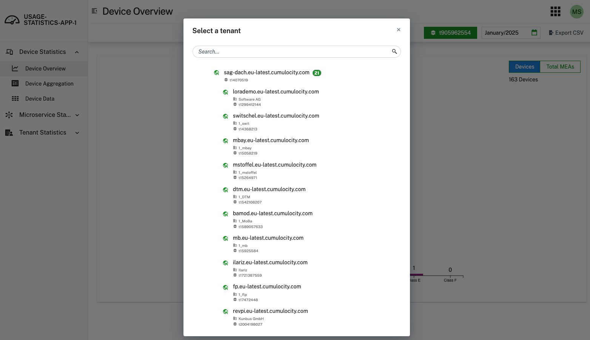
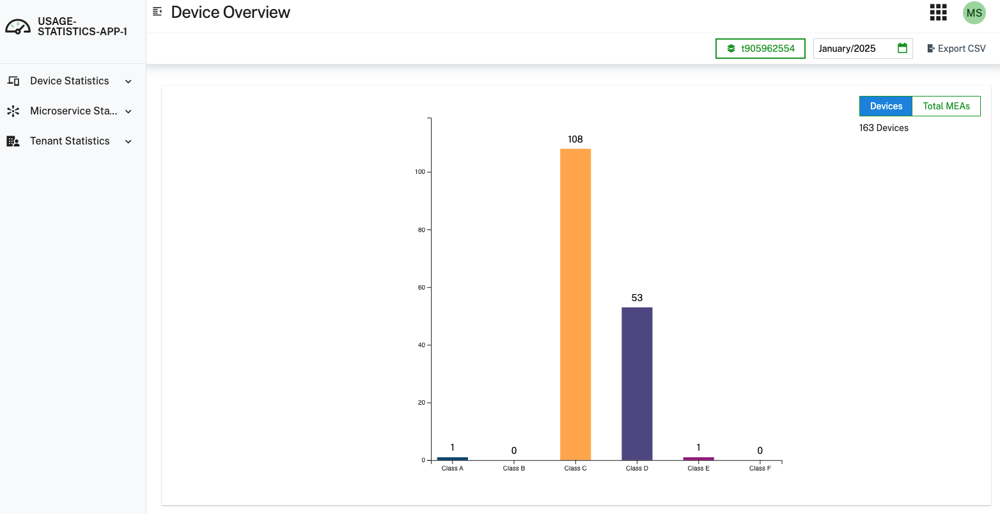
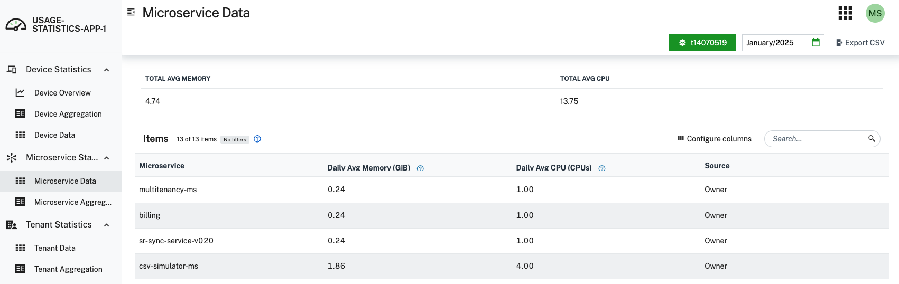
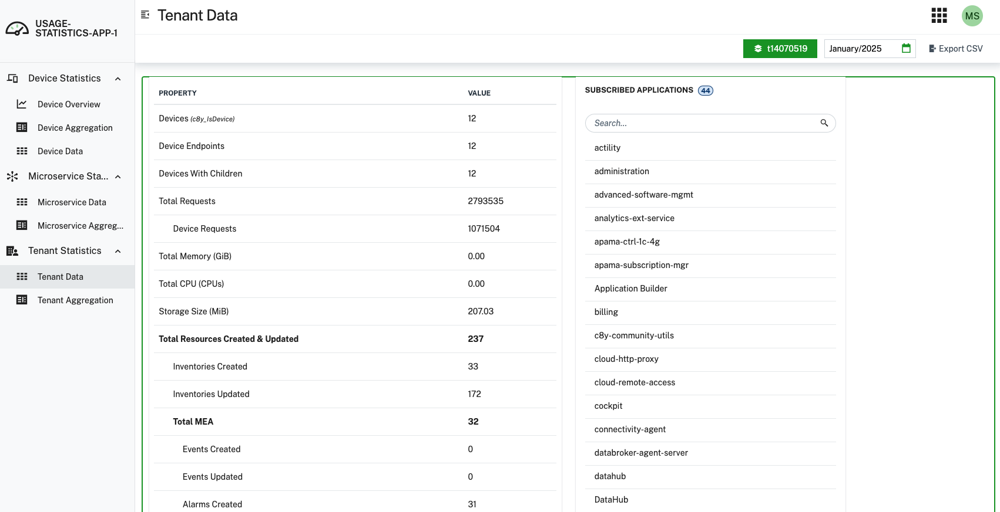

# Cumulocity IoT Usage Statistics Application
## Overview 
The `Usage Statistics Application` enables you to view consumption and usage information for your tenant and any child tenants within Cumulocity IoT. Many different types of data are present, including device statistics, microservice statistics, and tenant statistics.

****NOTE****
If you are using an enterprise tenant consider to install the  [metrics-aggregatro](https://github.com/Cumulocity-IoT/c8y-usage-statistics-ng/releases/latest) microservice in it. It will enable you to view aggregated metrics on top level.

**`Note: The Usage Statistics Application is still actively in development, and this release should be considered a preliminary public preview of the full application. See below for roadmap (subject to change). This preliminary version of the application works best in Google Chrome.`**

## Features

### Overview of Features
The `Usage Statistics Application` consists of the following statistics:
- `Device Statistics` - Calculates the device classification for each device connected to Cumulocity IoT, giving you greater ability to investigate the amount of data each device is sending to the platform. This includes also the Device Aggregation that sums up all subtenants blow the (including) enterprise  tenant.
- `Microservice Statistics` - Understand the resources used behind each deployed microservice and identify areas of optimization. This includes also the Microservice Aggregation that sums up all subtenants blow the (including) enterprise  tenant.
- `Tenant Statistics` - Discover other data points related to tenant consumption, including metrics such as total storage used and subscribed applications. This includes also the Tenant Aggregation that sums up all subtenants blow the (including) enterprise  tenant. 

The data in the app is available monthly on a per-tenant basis. Parent tenants can view statistics for individual child tenants. The month and tenant selectors are universal and apply throughout the application. Tenant selector is naturally not available in aggregated views.

##### Tenant Selector

Inactive tenants are black

##### Month Selector

### Device Statistics
`Device Statistics` gives you the ability to configure and analyze classification of devices for the selected tenant. In this context, a device is any inventory object that has at least one  measurement, event, or alarm over a month. You are able to investigate the total number of measurements, events, and alarms that each device sent over the course of a month.

There are six device classes defined as follows:
1. Class A = between 0 and 24 MEAs per day
2. Class B = between 24 and 144 MEAs per day
3. Class C = between 144 and 1440 MEAs per day
4. Class D = between 1440 and 8640 MEAs per day
5. Class E = between 8640 and 86400 MEAs per day
6. Class F = greater than 86400 MEAs per day

These ranges are inclusive for the lower bound and exclusive for the upper bound.

The `Device Statistics` data is available monthly for the selected tenant, and you can export the data to CSV for analysis outside of Cumulocity IoT. 

#### **Device Statistics Screenshots**
##### **Device Overview**

##### **Device Data**

### Microservice Statistics
`Microservice Statistics` enables you to look at your subscribed microservices and their resource usage for the selected tenant. When a microservice is subscribed to a tenant, it requests a certain amount of CPU power and Memory capacity. Whenever the microservice is active, Cumulocity IoT will allocate these resources to ensure the microservice can run appropropriately. Via `Microservice Statistics`, you can investigate the resources used by your deployed microservices.

The `Microservice Statistics` data is available monthly, and you can export the data to CSV for analysis outside of Cumulocity IoT. 

##### Microservice Data

##### Microservices Aggregation
Aggregation over all tenants, meaning when a microservice is deployed multiple times its values will be aggregated to a total. All values will also be aggregate to top level  which includes the total CCUs.

### Tenant Statistics
`Tenant Statistics` grants you access to other metrics associated with tenant usage in Cumulocity IoT. This includes data for storage, API requests, and other ways counting the number of devices connected. You can also see all of the subscribed applications for the tenant, which includes both microservices and UI apps. 

The `Tenant Statistics` data is available monthly, and you can export the data to CSV for analysis outside of Cumulocity IoT.

#### Tenant Statistics Screenshots
##### Tenant Data

# Metrics Aggregator Microservice
This microservice serves as a backend for the Usage Statistics Webapp of Cumulocity IoT.
It performs an aggregation of all subtenants assets of an Enterprise Tenant (including itself). I covers Device Classes-, Microservices- and Tenant-Statistics The following endpoint lets you request the statistics:

# Statistics Endpoints

## Devices
https://<deployed tenant>.cumulocity.com/service/metrics-aggregator/devices/{type monthly|daily}/{date e.g. 2024-12-01}?includeSubtenants=true

Given the date it will gather either a daily (type) or monthly statistics. Given includeSubtenants=true it will also output the subtenant device class statistics. The output will consist of an array of device classes which are requested form the tenant options of each tenant. Is not device class definition found in the tenant options a default device class configuration is used.

### Microservices
https://<deployed tenant>.cumulocity.com/service/metrics-aggregator/microservices/?dateFrom=2024-12-01&dateTo=2024-12-31

### Tenant
https://<deployed tenant>.cumulocity.com/service/metrics-aggregator/tenants/?dateFrom=2024-12-01&dateTo=2024-12-31

## We want your feedback!
The `Usage Statistics Application` is available to you in a public preview so that we can collect your feedback. Please share any and all of your feedback, both positive and negative. Please contact marco.stoffel@cumulocity.com

Please note that this tool is provided as-is and without warranty or support. It does not constitute part of the Cumulocity product. 
This application works best with [Google Chrome](https://www.google.com/chrome/) and Cumulocity UI version as mentioned below

### Compatibility
| Statistics App | Cumulocity |
|:---------------|:----------:|
| 0.1.x          |   10.17+   |
|                |            |

