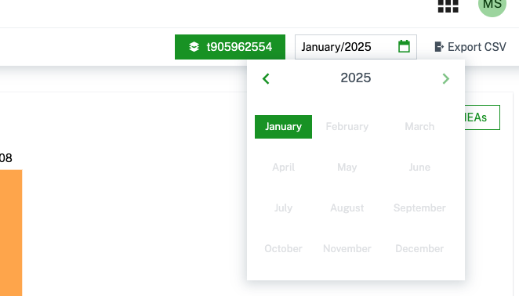
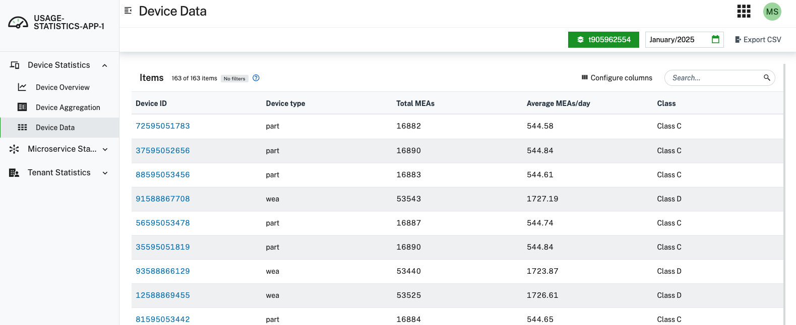

# Cumulocity IoT Usage Statistics Application
## Overview 
The `Usage Statistics Application` enables you to view consumption and usage information for your tenant and any child tenants within Cumulocity IoT. Many different types of data are present, including device statistics, microservice statistics, and tenant statistics. In addition, for select metrics, you have the ability to configure custom categories and thresholds, so that you can track your usage against pre-defined values. 

**`Note: The Usage Statistics Application is still actively in development, and this release should be considered a preliminary public preview of the full application. See below for roadmap (subject to change). This preliminary version of the application works best in Google Chrome.`**

## Features

### Overview of Features
The `Usage Statistics Application` consists of the following statistics:
- `Device Statistics` - Calculates the device classification for each device connected to Cumulocity IoT, giving you greater ability to investigate the amount of data each device is sending to the platform. 
- `Microservice Statistics` - Understand the resources used behind each deployed microservice and identify areas of optimization.
- `Tenant Statistics` - Discover other data points related to tenant consumption, including metrics such as total storage used and subscribed applications. 

The data in the app is available monthly on a per-tenant basis. Parent tenants can view statistics for individual child tenants. The month and tenant selectors are universal and apply throughout the application. 
#### Configuration Screenshots
##### Tenant Selector

##### Month Selector

### Device Statistics
`Device Statistics` gives you the ability to configure and analyze classification of devices for the selected tenant. In this context, a device is any inventory object that has at least one  measurement, event, or alarm over a month. You are able to investigate the total number of measurements, events, and alarms that each device sent over the course of a month. In addition, you are able to set custom classes based on the average frequency of data being sent, along with thresholds per class.

By default, there are six device classes defined as follows:
1. Class A = between 0 and 24 MEAs per day
2. Class B = between 24 and 144 MEAs per day
3. Class C = between 144 and 1440 MEAs per day
4. Class D = between 1440 and 8640 MEAs per day
5. Class E = between 8640 and 86400 MEAs per day
6. Class F = greater than 86400 MEAs per day

These ranges are inclusive for the lower bound and exclusive for the upper bound. The ranges and names of each classification can be modified by the end user. In addition, for each classification, the user can define a threshold. This threshold will compare the amount of devices in each class, and then calculate a percentage on the `Device Overview` page. 

The `Device Statistics` data is available monthly for the selected tenant, and you can export the data to CSV for analysis outside of Cumulocity IoT. 

#### **Device Statistics Screenshots**
##### **Device Overview**

##### **Device Data**

##### **Device Configuration**

### Microservice Statistics
`Microservice Statistics` enables you to look at your subscribed microservices and their resource usage for the selected tenant. When a microservice is subscribed to a tenant, it requests a certain amount of CPU power and Memory capacity. Whenever the microservice is active, Cumulocity IoT will allocate these resources to ensure the microservice can run appropropriately. Via `Microservice Statistics`, you can investigate the resources used by your deployed microservices.

In addition, just like with the devices, you have the ability to define custom categories and thresholds for your microservices. There are 3 default categories for microservices - Product Services, Streaming Analytics, and Machine Learning. These correspond to Software AG provided microservices and are the default values. Every other microservice that does not fit in these categories is considered a "Custom Microservice" and treated like a fourth category. You are able to view each category individually, enabling you to draw conclusions about your usage and where you can optimize your deployments. 

The `Microservice Statistics` data is available monthly, and you can export the data to CSV for analysis outside of Cumulocity IoT. 

#### Microservice Statistics Screenshots
##### Microservice Overview - Category Overview

##### Microservice Overview - Services Overview

##### Microservice Data

##### Microservice Configuration

### Tenant Statistics
`Tenant Statistics` grants you access to other metrics associated with tenant usage in Cumulocity IoT. This includes data for storage, API requests, and other ways counting the number of devices connected. You can also see all of the subscribed applications for the tenant, which includes both microservices and UI apps. 

The `Tenant Statistics` data is available monthly, and you can export the data to CSV for analysis outside of Cumulocity IoT.

#### Tenant Statistics Screenshots
##### Tenant Data

## Roadmap
The intent of this initial version of the 'Usage Statistics Application' is to collect feedback and define a clear roadmap. There are many directions that this application could be taken, and we want to hear from users on what would be the most valuable path to go down. Please submit your feedback at the link below!

## We want your feedback!
The `Usage Statistics Application` is available to you in a public preview so that we can collect your feedback. Please share any and all of your feedback, both positive and negative, on the [Cumulocity IoT Feedback Portal](https://cumulocityiot.ideas.aha.io/). 

Please note that this tool is provided as-is and withuot warranty or support. It does not constitute part of the Software AG product suite. 
This application works best with [Google Chrome](https://www.google.com/chrome/) and Cumulocity UI version as mentioned below

### Compatibility
| Statistics App | Cumulocity |
|:---------------|:----------:|
| 0.1.x          |   10.17+   |
|                |            |

